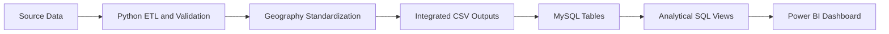
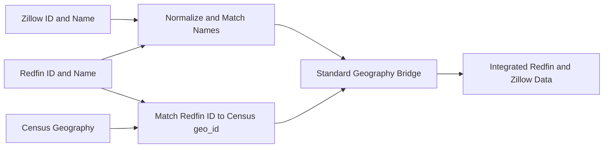

# Housing Market Intelligence Platform


An end-to-end data engineering and analytics project that integrates U.S. housing prices, rents, household income, mortgage rates, and market activity into one standardized metropolitan-market model.

The project uses Python ETL pipelines, a reusable geography bridge, MySQL analytical views, and a seven-page Power BI dashboard to examine housing affordability and local market conditions across **375 U.S. metropolitan markets in 2024**.


## Table of Contents

- [Project Objective](#project-objective)
- [Key Findings](#key-findings)
- [Data Sources](#data-sources)
- [Architecture](#architecture)
- [The Geography Integration Challenge](#the-geography-integration-challenge)
- [Why Zillow Data Required `melt()`](#why-zillow-data-required-melt)
- [Data Model](#data-model)
- [Analytical Questions](#analytical-questions)
- [Dashboard](#dashboard)
- [Mortgage Methodology](#mortgage-methodology)
- [Data Quality and Validation](#data-quality-and-validation)
- [Project Structure](#project-structure)
- [How to Run the Project](#how-to-run-the-project)
- [Limitations](#limitations)
- [Future Improvements](#future-improvements)
- [Author](#author)

## Project Objective

Housing affordability cannot be understood from home prices alone. A market with high prices may also have high incomes, while a market with lower prices may still be difficult to afford if local income is low. Rent, mortgage rates, available inventory, and market speed add more context.

This project was built to answer a practical question:

> How do home prices, rent, income, financing costs, and housing supply interact across U.S. metropolitan markets?

The project demonstrates the complete data lifecycle:

1. Extract data from APIs and downloadable source files.
2. Clean and validate each source independently.
3. Standardize incompatible geographic identifiers.
4. Integrate monthly housing, rent, income, and mortgage data.
5. Load analysis-ready tables into MySQL.
6. Create reusable SQL views for affordability and market analysis.
7. Present the results in an interactive Power BI dashboard.

## Key Findings

| Finding | 2024 result |
|---|---:|
| Markets included in the final analysis | **375** |
| Average home price across markets | **$349,983** |
| Average monthly rent | **$1,499** |
| Average median household income | **$74,889** |
| Average housing supply | **3.39 months** |
| Average days on market | **43 days** |

Additional findings:

- Home prices and rents had the strongest measured relationship, with a correlation of **0.883**.
- Household income was strongly related to home prices (**0.793**) and rent (**0.723**).
- Annual rent reached **44.67%** of median household income in the most rent-burdened market.
- Rochester, Reading, and Lancaster were among the hottest supply candidates, with approximately **1.10–1.26 months of supply**.
- Parkersburg-Vienna and Midland were among the coolest supply candidates, with approximately **16.47** and **13.05 months of supply**, respectively.
- The findings show why housing should be evaluated locally: national or cross-market averages can hide large differences in affordability and supply.

Correlation describes association, not causation.

## Data Sources

| Source | Dataset | Role in the project |
|---|---|---|
| [U.S. Census Bureau](https://api.census.gov/data/2024/acs/acs5.html) | 2024 ACS 5-Year, `B19013_001E` | Median household income by metropolitan geography |
| [Federal Reserve Bank of St. Louis](https://fred.stlouisfed.org/series/MORTGAGE30US) | FRED `MORTGAGE30US` | Weekly 30-year fixed mortgage rates, aggregated to monthly averages |
| [Redfin Data Center](https://www.redfin.com/news/data-center/) | Monthly housing-market data | Prices, sales, inventory, days on market, and months of supply |
| [Zillow Research](https://www.zillow.com/research/data/) | Zillow Observed Rent Index (ZORI) | Monthly market-level rent estimates |
| [U.S. Census TIGER/Line](https://www.census.gov/geographies/mapping-files/time-series/geo/tiger-line-file.html) | 2024 CBSA and metropolitan-division shapefiles | Latitude and longitude for Power BI mapping |

The raw source files retain longer historical coverage where available, but the final analytical layer is scoped to **2024**.

### Processed data scale

Counts below exclude CSV header rows.

| Processed dataset | Records |
|---|---:|
| Census geography and income | 426 |
| FRED monthly mortgage rates | 665 |
| Standardized geography bridge | 378 |
| Redfin market-month records prepared for MySQL | 52,464 |
| Zillow integrated market-month records | 42,235 |
| Complete markets used in the 2024 dashboard | 375 |

## Architecture



Four source-specific pipelines perform extraction, transformation, and validation. The geography-integration stage then connects Redfin and Zillow identifiers to a standard Census `geo_id`. MySQL provides the relational and analytical layer, while Power BI imports purpose-built views rather than repeating calculations inside visuals.

## The Geography Integration Challenge

The sources do not use a shared market identifier:

- Census uses five-digit CBSA or metropolitan-division codes.
- Redfin uses Redfin region IDs and slightly different market names.
- Zillow uses Zillow region IDs and its own naming conventions.

The solution was a reusable `geography_bridge` that stores:

- `geo_id`
- `redfin_region_id`
- `zillow_region_id`
- standardized market name
- geography type
- parent metropolitan code when applicable
- latitude and longitude

The bridge is created by normalizing market names, applying a small set of manually verified name corrections, matching Redfin IDs to Census geography codes, and validating one-to-one mappings. It is then joined back to the monthly Redfin and Zillow records.



Validation confirms that the integrated Redfin and Zillow records contain no missing `geo_id` values and no duplicate market-month combinations.

## Why Zillow Data Required `melt()`

The original Zillow ZORI file is stored in **wide format**: each market occupies one row and every month is a separate column. Redfin and FRED, however, use a time-series structure where each date is a separate row.

Pandas `melt()` converts Zillow's monthly columns into two fields—`date` and `rent`—producing one row per market-month:

```python
id_columns = [
    "RegionID",
    "SizeRank",
    "RegionName",
    "RegionType",
    "StateName"
]

df_long = df.melt(
    id_vars=id_columns,
    var_name="date",
    value_name="rent"
)
```

This transformation makes the data easier to:

- validate at the market-month grain;
- join to Redfin data by market and month;
- store in a normalized MySQL table;
- filter and aggregate as a time series; and
- use in Power BI without hundreds of separate date columns.

## Data Model

| Table | Grain | Primary key | Purpose |
|---|---|---|---|
| `geography_bridge` | One row per standardized market | `geo_id` | Connects Census, Redfin, and Zillow identifiers |
| `census_income` | One row per market-year | `geo_id`, `income_year` | Stores median household income |
| `redfin_housing_monthly` | One row per market-month | `geo_id`, `period_begin` | Stores price and housing-activity measures |
| `zillow_rent_monthly` | One row per market-month | `geo_id`, `rent_date` | Stores monthly rent estimates |
| `mortgage_rates_monthly` | One row per month | `month` | Stores monthly average mortgage rates |

`geo_id` is the central foreign key connecting the geography, income, housing, and rent tables. Mortgage rates are national monthly values and therefore do not require a geographic foreign key.

The `market_affordability_base` and `market_map_2024` views combine the core measures and provide a reusable foundation for the ten analytical views used by Power BI.

## Analytical Questions

| # | Question | Power BI view |
|---:|---|---|
| 1 | Which markets had the highest and lowest average home prices? | `vw_2024_sale_price_extremes` |
| 2 | Which markets had the highest and lowest average rents? | `vw_2024_rent_extremes` |
| 3 | Which markets had the highest and lowest home-price-to-income ratios? | `vw_2024_price_income_ratio_extremes` |
| 4 | Where was renting cheaper or more expensive than an estimated mortgage payment? | `vw_2024_rent_vs_est_mortgage` |
| 5 | What did the average market in the dataset look like? | `vw_2024_average_market_profile` |
| 6 | Which markets were most and least affordable based on mortgage burden? | `vw_2024_mortgage_income_burden_extremes` |
| 7 | Which markets had the highest and lowest rent-to-income ratios? | `vw_2024_rent_income_ratio_extremes` |
| 8 | Where was the estimated mortgage-versus-rent gap largest? | `vw_2024_est_mortgage_rent_gap_extremes` |
| 9 | How strongly were income, home prices, and rent related? | `vw_2024_market_correlations` |
| 10 | Which markets appeared hottest or coolest based on supply and activity? | `vw_2024_supply_heat_candidates` |

## Dashboard

The Power BI report contains seven connected pages:

1. **Overview** — the typical 2024 market profile.
2. **Price & Rent** — highest and lowest prices, rents, and income burdens.
3. **Buy vs Rent** — monthly payment comparisons and affordability gaps.
4. **Relationships** — correlations among income, home prices, and rent.
5. **Market Heat** — supply, selling speed, inventory, and sales activity.
6. **U.S. Map** — an interactive map of metropolitan markets.
7. **Conclusions** — summarized findings and final takeaways.

<details>
<summary><strong>View the remaining dashboard pages</strong></summary>

### Price and Rent Rankings


### Renting vs. Buying


### Market Relationships


### Market Heat


### U.S. Market Map


### Conclusions


</details>

The report is stored as a Power BI Project (`.pbip`), keeping report and semantic-model definitions in source-control-friendly text files.

## Mortgage Methodology

The estimated mortgage payment uses the standard fixed-rate amortization formula:

```text
Monthly payment = Principal × [r(1 + r)^n] / [(1 + r)^n − 1]
```

Assumptions:

- 20% down payment, so the loan principal is 80% of the average home price;
- 30-year fixed-rate mortgage;
- 360 monthly payments;
- average 2024 30-year mortgage rate from FRED; and
- principal and interest only.

The estimate excludes property taxes, homeowners insurance, mortgage insurance, HOA fees, closing costs, maintenance, and utilities. It is intended as a consistent cross-market comparison, not a personalized loan quote.

Mortgage burden is calculated as:

```text
Estimated monthly mortgage / (annual median household income / 12) × 100
```

Rent burden is calculated as:

```text
Monthly rent × 12 / annual median household income × 100
```

## Data Quality and Validation

Each ETL pipeline includes assertions or explicit checks for:

- missing primary identifiers and dates;
- duplicate geography or market-month records;
- missing core price, rent, income, and mortgage values;
- nonpositive prices, rents, income, sales, or mortgage rates;
- invalid percentage ranges;
- impossible negative activity values;
- one-to-one geography mappings;
- missing coordinates; and
- missing standardized `geo_id` values after integration.

The project avoids filling missing Zillow rent observations with invented values. Records without observed rent are excluded from the transformed rent dataset.

## Project Structure

```text
Housing-Market-Intelligence-Platform/
dashboard/
├── Housing-Market-Intelligence-dashboard.Report/
├── Housing-Market-Intelligence-dashboard.SemanticModel/
└── Housing-Market-Intelligence-dashboard.pbip
│
├── data/
│   ├── raw/                # Original API responses and downloaded files
│   └── processed/          # Cleaned and integrated CSV outputs
├── images/                 # Dashboard screenshots
├── notebooks/              # Exploration and development notebooks
├── sql/
│   └── housing_market_intelligence_platform.sql
├── src/
│   ├── census_income_etl.py
│   ├── fred_mortgage_etl.py
│   ├── geography_integration.py
│   ├── redfin_housing_etl.py
│   └── zillow_rent_etl.py
├── .env                    # Local API keys; excluded from Git
├── .gitignore
├── requirements.txt
└── README.md
```

## How to Run the Project

### 1. Clone the repository

```bash
git clone <YOUR_REPOSITORY_URL>
cd Housing-Market-Intelligence-Platform
```

### 2. Create and activate a virtual environment

```bash
python -m venv .venv
```

Windows PowerShell:

```powershell
.venv\Scripts\Activate.ps1
```

### 3. Install the Python dependencies

```bash
pip install pandas requests python-dotenv geopandas
```

GeoPandas also installs the libraries required to read the Census TIGER/Line shapefiles.

### 4. Configure API keys

Create a `.env` file in the project root:

```env
CENSUS_API_KEY=your_census_api_key
FRED_API_KEY=your_fred_api_key
```

Never commit the `.env` file or real API keys.

### 5. Run the ETL pipelines

Run the four source pipelines first, followed by geography integration:

```bash
python src/census_income_etl.py
python src/fred_mortgage_etl.py
python src/redfin_housing_etl.py
python src/zillow_rent_etl.py
python src/geography_integration.py
```

The geography-integration script depends on the cleaned Census, Redfin, and Zillow outputs created by the earlier scripts.

### 6. Build the MySQL analysis layer

Open `sql/housing_market_intelligence_platform.sql` in MySQL Workbench. The file documents the relational schema, validation queries, base analytical views, and the ten question-specific Power BI views.

Load the processed CSVs in dependency order:

1. geography bridge;
2. Census income;
3. Redfin monthly housing;
4. Zillow monthly rent; and
5. FRED monthly mortgage rates.

CSV import locations are machine-specific, so database loading is performed through MySQL Workbench before the analytical views are created or refreshed.

### 7. Open the Power BI report

Open:

```text
dashboard/Housing-Market-Intelligence-dashboard.pbip
```

Update the MySQL data-source credentials if required, and refresh the model after the database views are available.

## Limitations

- The final comparison is a 2024 cross-sectional market analysis and is not a housing forecast.
- Mortgage estimates exclude several material ownership costs and should not be interpreted as personalized financial advice.
- Market averages do not represent the experience of every household or property within a metropolitan area.
- Data providers use different definitions and geographic identifiers; the geography bridge reduces this mismatch but depends on source naming remaining reasonably stable.
- Zillow rent coverage is incomplete for some historical market-month combinations; missing observations are excluded rather than imputed.
- Correlation measures association and does not establish causation.
- Extreme monthly supply values can materially influence annual averages in smaller markets.

## Future Improvements

- Automate processed-CSV loading into MySQL.
- Add orchestration, logging, and scheduled refreshes.
- Incorporate property taxes, insurance, HOA fees, and maintenance into the ownership-cost model.
- Add multi-year trend analysis and year-over-year comparisons.
- Introduce automated tests for schema changes and source-data drift.
- Publish the Power BI report when an appropriate organizational account is available.

## Author

**[Abahoor Lion]**

- LinkedIn: (www.linkedin.com/in/abahoor-lion)
- Email: (abahoorlion@gmail.com)

---

If you found this project useful, consider starring the repository.
